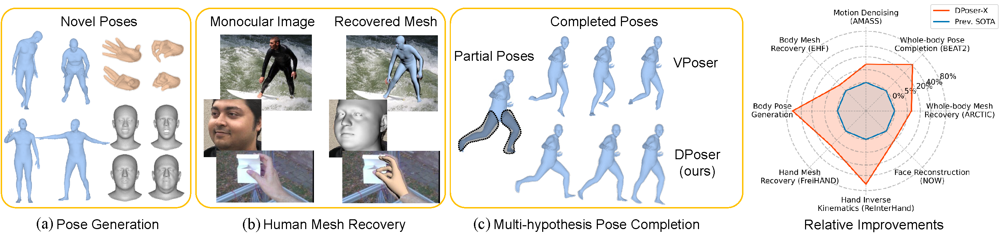

# 🌟 DPoser-X: Diffusion Model as Robust 3D Whole-body Human Pose Prior 🌟

## 🎉 ICCV 2025 Oral

### [🔗 Project Page](https://dposer.github.io/) | [🎥 Video](https://youtu.be/yzwliadFcX0) | [📄 Paper](https://arxiv.org/abs/2508.00599)

[Junzhe Lu](https://scholar.google.com/citations?user=907PxdcAAAAJ)<sup>1,\*</sup>, [Jing Lin](https://jinglin7.github.io/)<sup>2,\*</sup>, [Hongkun Dou](https://scholar.google.com/citations?user=pSNEkEwAAAAJ)<sup>3</sup>, [Ailing Zeng](https://ailingzeng.site)<sup>4</sup>, [Yue Deng](https://shi.buaa.edu.cn/yuedeng/en/index.htm)<sup>3</sup>, [Xian Liu](https://alvinliu0.github.io/)<sup>5</sup>, [Zhongang Cai](https://caizhongang.com/)<sup>6</sup>, [Lei Yang](https://www.yanglei.me/)<sup>6</sup>, [Yulun Zhang](http://yulunzhang.com/)<sup>7</sup>, [Haoqian Wang](https://www.sigs.tsinghua.edu.cn/whq_en/main.psp)<sup>1,†</sup>, [Ziwei Liu](https://liuziwei7.github.io/)<sup>2,†</sup>


<sup>*</sup> Equal contribution. <sup>†</sup> Corresponding authors.

<p align="center">

<br>
<em>📊 An overview of DPoser-X’s versatility and performance across multiple pose-related tasks</em>
</p>

## 📘 1. Introduction  

Welcome to the official implementation of *DPoser-X: Diffusion Model as Robust 3D Whole-body Human Pose Prior.* 🚀  
In this repository, we're excited to introduce DPoser-X, a robust 3D whole-body human pose prior leveraging diffusion models. 
Seamlessly integrating with various pose-centric tasks involving the body, hands, and face, DPoser-X surpasses existing pose priors, achieving up to 61% improvement across 8 benchmarks.


## 🛠️ 2. Setup Your Environment 

- **Tested Configuration**: Our code have been tested on PyTorch 1.12.1 with CUDA 11.3.

- **Installation Recommendation**:
  ```shell
  conda install pytorch==1.12.1 torchvision==0.13.1 cudatoolkit=11.3 -c pytorch
  conda install -c conda-forge pytorch-lightning=2.1.0
  ```
- **Required Python Packages**:
  ```shell
  pip install -r requirements.txt
  ```
- **Human Models**:
We use human models like [SMPLX](https://smpl-x.is.tue.mpg.de/), [MANO](https://mano.is.tue.mpg.de/), [FLAME](https://flame.is.tue.mpg.de/) in our experiments. Make sure to set the `--bodymodel-path` parameter correctly in scripts like `demo.py` based on your body model's download location.


## 🚀 3. Quick Demo

* **Pre-trained Models**: You can download the pre-trained DPoser-X models from either Hugging Face Hub or Google Drive. Place them in the `./pretrained_models` directory.

    * **Option 1: Hugging Face Hub (Recommended)**
        You can download all required models with a single command using the Hugging Face CLI.
        ```bash
        # Make sure you have huggingface-hub installed: pip install huggingface-hub
        huggingface-cli download Moon-bow/DPoser-X --repo-type model --local-dir pretrained_models --local-dir-use-symlinks False
        ```

    * **Option 2: Google Drive**
        Alternatively, you can download the models manually from [here](https://drive.google.com/drive/folders/1Xlgw0qAlkG-Hz1xSFzO-EpND6jJDBnXL?usp=drive_link).
      
* **Sample Data**: Check out `./examples` for some samples, including some images with detected keypoints annotation and pose files.

* **Explore DPoser-X Tasks**:

### DPoser-body
<details>
<summary> Body Pose Generation</summary>

Generate poses and save rendered images:
  ```shell
  python -m run.tester.body.demo --config configs/body/subvp/timefc.py --task generation
  ```
For videos of the generation process:
  ```shell
  python -m run.tester.body.demo --config configs/body/subvp/timefc.py --task generation_process
  ```
</details>

<details>
<summary> Body Pose Completion</summary>

Complete body poses and save the visualization results:
  ```shell
  python -m run.tester.body.demo --config configs/body/subvp/timefc.py --task completion --hypo 10 --part right_arm --view right_half
  ```
Explore other solvers like [ScoreSDE](https://github.com/yang-song/score_sde_pytorch) for our DPoser prior:
  ```shell
  python -m run.tester.body.demo --config configs/body/subvp/timefc.py --task completion --mode ScoreSDE --hypo 10 --part right_arm --view right_half
  ```
</details>

<details>
<summary> Motion Denoising</summary>

Summarize visual results in a video:
  ```shell
  python -m run.tester.body.motion_denoising --config configs/body/subvp/timefc.py --file-path ./examples/Gestures_3_poses_batch005.npz --noise-std 0.04
  ```
</details>

<details>
<summary> Body Mesh Recovery</summary>

Use the detected 2D keypoints from [ViTPose](https://github.com/ViTAE-Transformer/ViTPose) and save fitting results:
  ```shell
  python -m run.tester.body.demo_fit --img ./examples/body/images/01_img.jpg --kpt_path ./examples/body/predictions/01_img.json
  ```
</details>


### DPoser-hand
<details>
<summary> Hand Pose Generation</summary>

Generate hand poses and save rendered images:
  ```shell
  python -m run.tester.hand.demo --config configs/hand/subvp/timefc.py --task generation
  ```
</details>

<details>
<summary> Hand Inverse Kinematics</summary>

Perform hand inverse kinematics and save the visualization results:
  ```shell
  python -m run.tester.hand.demo --config configs/hand/subvp/timefc.py --task inverse_kinematics --ik-type partial 
  ```
</details>

<details>
<summary> Hand Mesh Recovery</summary>

Use the detected 2D keypoints from [MMPose hand model](https://mmpose.readthedocs.io/en/latest/user_guides/inference.html) and save fitting results:
  ```shell
  python -m run.tester.hand.demo_fit --img ./examples/hands/images/00000014.jpg --mmpose ./examples/hands/predictions/00000014.json
  ```
</details>


### DPoser-face
<details>
<summary> Face Pose Generation</summary>

Generate face shapes & expressions and save rendered images:
  ```shell
  python -m run.tester.face.demo --config configs/face_full/subvp/combiner.py --task generation
  ```
</details>

<details>
<summary> Face Inverse Kinematics</summary>

Perform face inverse kinematics and save the visualization results:
  ```shell
  python -m run.tester.face.demo --config configs/face_full/subvp/combiner.py --task inverse_kinematics --ik-type noisy --noise_std 0.005
  ```
</details>

<details>
<summary>Face Reconstruction</summary>

TBD, it's based on another open-source [repo](https://github.com/HavenFeng/photometric_optimization).
</details>


### DPoser-X
<details>
<summary> Whole-Body Pose Generation</summary>

Generate whole body poses and save rendered images:
  ```shell
  python -m run.tester.wholebody.demo --config configs/wholebody/subvp/mixed.py --task generation
  ```
</details>

<details>
<summary> Whole-body Pose Completion</summary>

Complete whole body poses and save the visualization results:
  ```shell
  python -m run.tester.wholebody.demo --config configs/wholebody/subvp/mixed.py --task completion  --part lhand --hypo 5
  ```
</details>

<details>
<summary> Whole-body Mesh Recovery</summary>

Use the detected 2D keypoints from [ViTPose](https://github.com/ViTAE-Transformer/ViTPose) and save fitting results:
  ```shell
  python -m run.tester.wholebody.demo_fit --img ./examples/body/images/01_img.jpg --kpt_path ./examples/body/predictions/01_img.json
  ```
</details>


## 🧑‍🔬 4. Train DPoser-X Yourself
### Dataset Preparation
See the documentation in `lib/data/Data_preparation.md` for detailed instructions on preparing the training datasets.

### Start Training
After setting up your dataset, begin training DPoser-X. We support training for body, hand, face and whole-body models:

**Body Model Training**:
  ```shell  
  python -m run.trainer.body.diffusion -c configs.body.subvp.timefc.get_config --name reproduce_body
  ```

**Hand Model Training**:
  ```shell
  python -m run.trainer.hand.diffusion -c configs.hand.subvp.timefc.get_config --name reproduce_hand
  ```

**Face Model Training**:
  ```shell
  python -m run.trainer.face.diffusion -c configs.face.subvp.pose_timefc.get_config --name reproduce_face
  ```

**Whole-body Model Training**:
  ```shell
  python -m run.trainer.wholebody.diffusion -c configs.wholebody.subvp.mixed.get_config --name reproduce_wholebody
  ```

For all training models, the checkpoints and TensorBoard logs will be stored under `./checkpoints` and `./logs` separately.


## 🧪 5. Test DPoser-X

### DPoser-body
<details>
<summary>Pose Generation</summary>

Quantitatively evaluate the generated samples using this script:
  ```shell
  python -m run.tester.body.demo --config configs/body/subvp/timefc.py --task eval_generation
  ```
This will use the [SMPL](https://smpl.is.tue.mpg.de/) body model to evaluate APD for 500 samples following [Pose-NDF](https://github.com/garvita-tiwari/PoseNDF).
Additionally, we evaluate the common metrics like [FID](https://github.com/mseitzer/pytorch-fid), [Precision, Recall](https://github.com/kynkaat/improved-precision-and-recall-metric) for 50000 samples.
</details>

<details>
<summary>Pose Completion</summary>

For testing on the AMASS dataset (make sure you've completed the dataset preparation in Step 4):
  ```shell
  python -m run.tester.body.completion --config configs/body/subvp/timefc.py --gpus 1 --hypo 10 --sample 10 --part legs
  ```
</details>

<details>
<summary>Motion Denoising</summary>

To evaluate motion denoising on the AMASS dataset, use the following steps:

- Split the `HumanEva` part of the AMASS dataset into fragments using this script:
  ```shell
  python lib/data/body_process/HumanEva.py --input-dir path_to_HumanEva --output-dir ./data/HumanEva_60frame  --seq-len 60
  ```
- Then, run this script to evaluate the motion denoising task on all sub-sequences in the `data-dir`:
  ```shell
  python -m run.tester.body.motion_denoising --config configs/body/subvp/timefc.py --data-dir ./data/HumanEva_60frame --noise-std 0.04
  ```
- Alternatively, run the denoising task with partial visible joints:
  ```shell
  python -m run.tester.body.motion_denoising_partial --config configs/body/subvp/timefc.py --data-dir ./data/HumanEva_60frame --part left_arm
  ```  
</details>

<details>
<summary>Body Mesh Recovery</summary>

To test on the EHF dataset, follow these steps:

- First, download the EHF dataset from [SMPLX](https://smpl-x.is.tue.mpg.de/).
- Next, detect the 2d keypoints using [ViTPose](https://github.com/ViTAE-Transformer/ViTPose).
  Ensure you follow this directory structure:
  ```
  ${EHF_ROOT}
  .
  |-- 01_align.ply
  |-- 01_img.jpg
  |-- 01_img.png
  |-- 01_scan.obj
  ...
  |-- vitpose_keypoints
      |-- predictions
            |-- 01_img.json
            |-- 02_img.json
            ...
    ```
  
- Specify the `--data-dir` and run this script:
  ```shell
  python -m run.tester.body.EHF --data-dir=path_to_EHF --outdir=./output/body/test_results/hmr/vitpose_kpts --kpts vitpose
  ```
</details>


### DPoser-hand
<details>
<summary>Hand Pose Generation</summary>

To evaluate the generated hands, run:
```shell
python -m run.tester.hand.demo --config configs/hand/subvp/timefc.py --task eval_generation
```
This will evaluate the generated hands using metrics such as APD, FID, Precision, Recall, and dNN.
</details>

<details>
<summary>Hand Inverse Kinematics</summary>

To perform hand inverse kinematics using DPoser, run the following script:
```shell
python -m run.tester.hand.inverse_kinematics --config configs/hand/subvp/timefc.py --ik-type sparse --gpus 4
```
This will perform hand inverse kinematics on sparse settings.
There are also other types of inverse kinematics available, such as noisy and partial. To use them, simply replace `--ik-type sparse` with `--ik-type noisy` or `--ik-type partial`.
</details>

<details>
<summary>Hand Mesh Recovery</summary>

To test hand mesh recovery on the FreiHAND dataset, run the following script:
```shell
python -m run.tester.hand.freihand --data-dir path_to_FreiHAND --outdir ./output/hand/test_results/hmr/gt_kpts --kpts gt --init none --device cuda:1
```
This will recover the hand mesh based on the provided configuration and save it under the specified output path.
</details>


### DPoser-face
<details>
<summary>Face Generation</summary>

To evaluate the generated faces, run:
```shell
python -m run.tester.face.demo --config configs/face_full/subvp/combiner.py --task eval_generation
```
This will evaluate the generated faces using FID, Precision, Recall, and DNN for face shape and expression separately.
</details>

<details>
<summary>Face Inverse Kinematics</summary>

To perform face inverse kinematics using DPoser, run the following script:
```shell
python -m run.tester.face.inverse_kinematics --gpus 4 --batch_size 500 --ik-type noisy --noise_std 0.005
```
This will perform inverse kinematics on noisy face data with a specified noise standard deviation and assess the metrics.
There are also other types of inverse kinematics available, such as left_face and right_face. To use them, simply replace `--ik-type noisy` with `--ik-type left_face` or `--ik-type right_face`.
</details>


### DPoser-X
<details>
<summary>Whole-Body Pose Generation</summary>

To evaluate the generated whole-body poses, run:

```shell
python -m run.tester.wholebody.demo --config configs/wholebody/subvp/mixed.py  --task eval_generation
```

This will compute the evaluation metrics used in our paper for generated whole-body poses.
</details>

<details>
<summary>Whole-Body Mesh Recovery</summary>

To test on the Arctic dataset, run the following script:

```shell
python -m run.tester.wholebody.batch_hmr --data_dir path_to_Arctic --prior DPoser --kpts mmpose
```

This script will fit the whole-body model to the Arctic dataset using the specified input keypoints type (`mmpose`) and compute the metrics.
</details>

<details>
<summary>Whole-Body Pose Completion</summary>

To evaluate whole-body pose completion on the EgoBody/Arctic/EMAGE dataset, run the following script:

```shell
python -m run.tester.wholebody.completion --config configs/wholebody/subvp/mixed.py --gpus 4 --hypo 10 --sample 10 --port 14601 --dataset egobody/arctic/emage
```
</details>


## ❓ Troubleshoots

- `RuntimeError: Subtraction, the '-' operator, with a bool tensor is not supported. If you are trying to invert a mask, use the '~' or 'logical_not()' operator instead.`: [Solution here](https://github.com/mks0601/I2L-MeshNet_RELEASE/issues/6#issuecomment-675152527)

- `TypeError: startswith first arg must be bytes or a tuple of bytes, not str.`: [Fix here](https://github.com/mcfletch/pyopengl/issues/27). 

- `ImportError: cannot import name 'bool' from 'numpy'`: [Fix here](https://github.com/mattloper/chumpy/issues/55). 

## 🙏 Acknowledgement
Big thanks to [ScoreSDE](https://github.com/yang-song/score_sde_pytorch), [GFPose](https://github.com/Embracing/GFPose), and [Hand4Whole](https://github.com/mks0601/Hand4Whole_RELEASE) for their foundational work and code.

## 📚 Reference  

```
@article{lu2025dposerx,
  title={DPoser-X: Diffusion Model as Robust 3D Whole-body Human Pose Prior},
  author={Lu, Junzhe and Lin, Jing and Dou, Hongkun and Zeng, Ailing and Deng, Yue and Liu, Xian and Cai, Zhongang and Yang, Lei and Zhang, Yulun and Wang, Haoqian and Liu, Ziwei},
  journal={arXiv preprint arXiv:2508.00599},
  year={2025}
}
```

